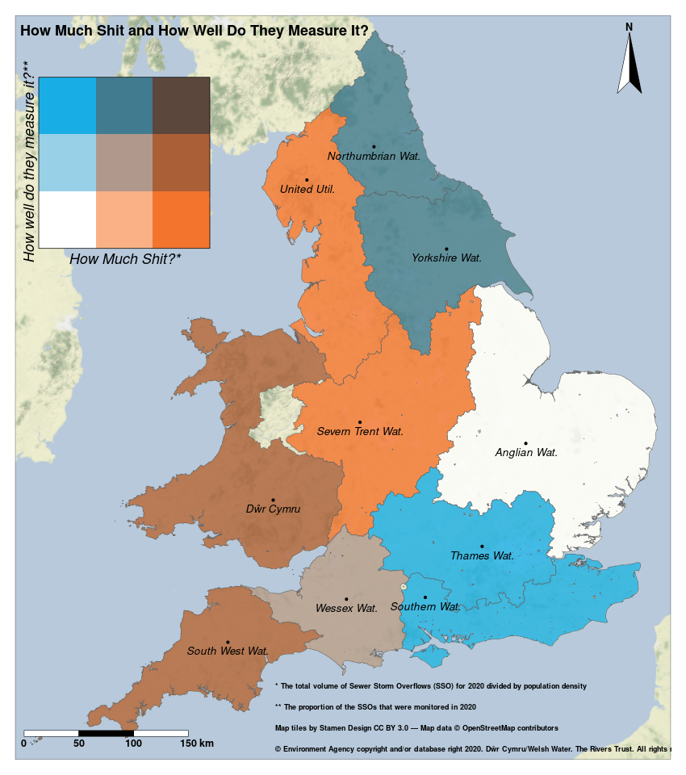
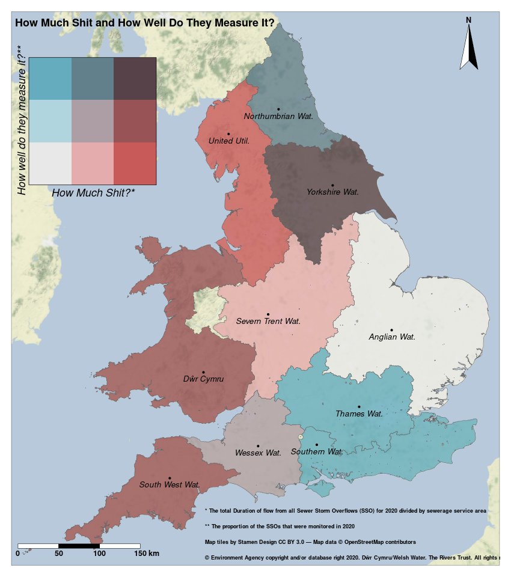
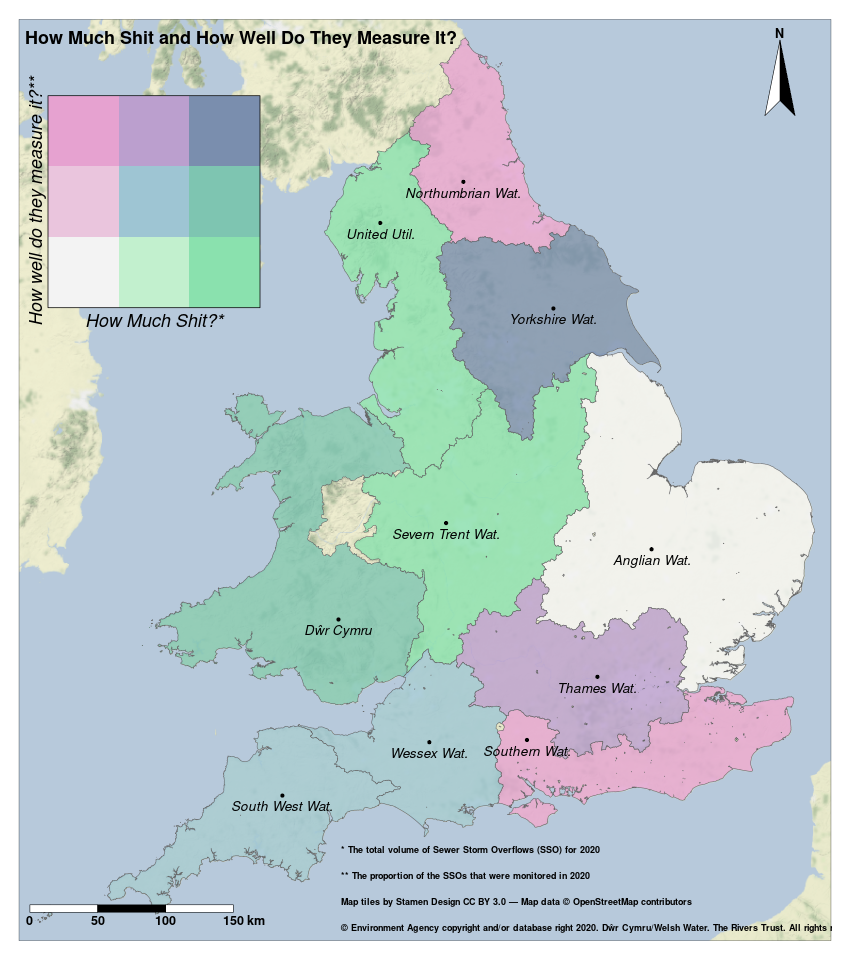
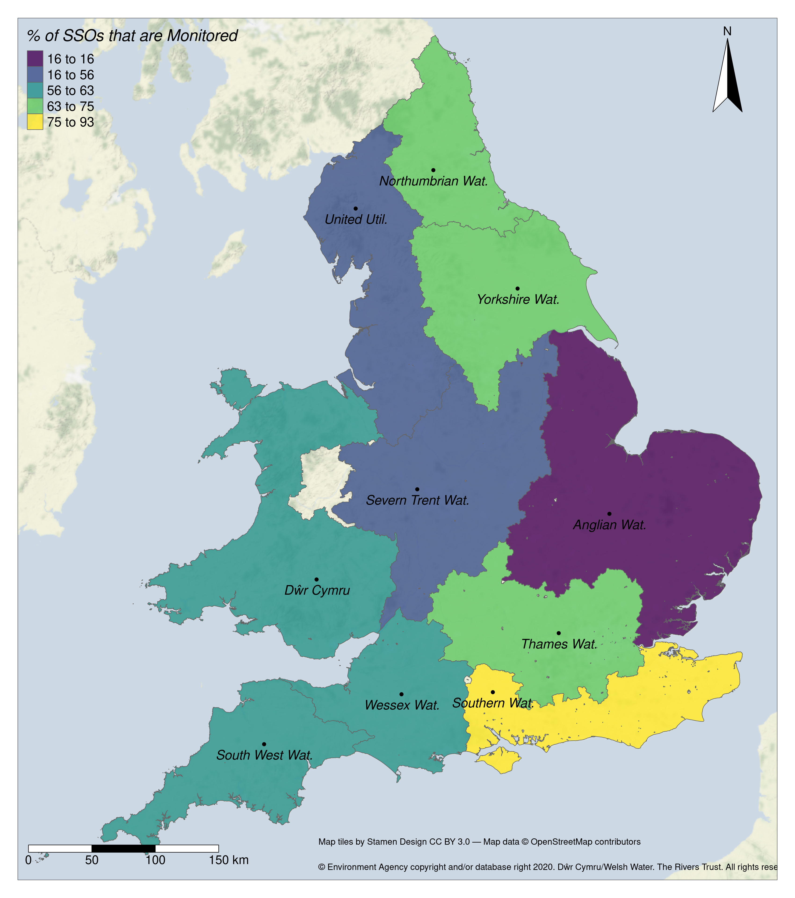
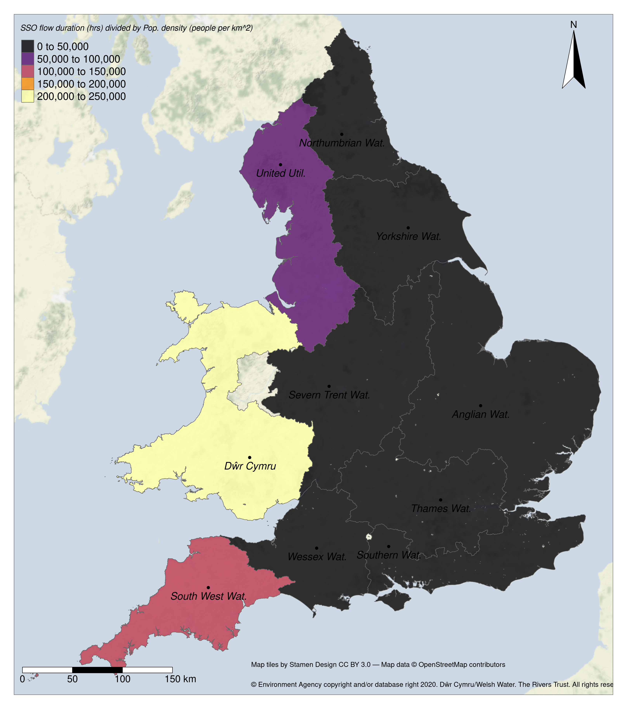
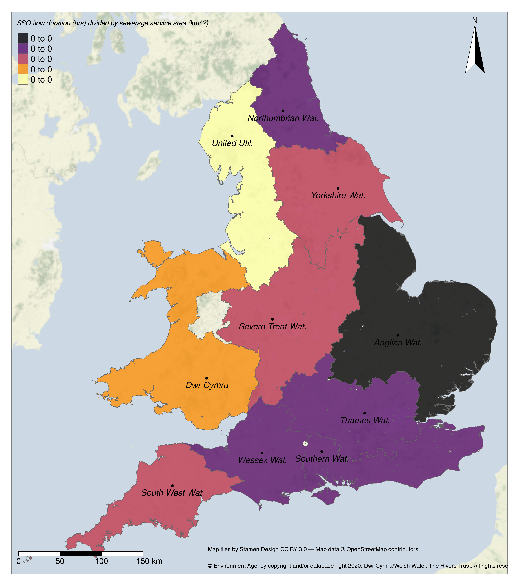

# SewageMapR

Some Maps about sewage...

Check out the Rivers Trust's great [interactive map](https://experience.arcgis.com/experience/e834e261b53740eba2fe6736e37bbc7b) to explore this data:

## Data sources:

[**England Unmonitored CSOs 2020**](https://data.catchmentbasedapproach.org/datasets/theriverstrust::-england-unmonitored-csos-2020/about)

[**Welsh Unmonitored CSOs 2020**](https://data.catchmentbasedapproach.org/datasets/theriverstrust::welsh-unmonitored-csos-2020/about)

[**Event Duration Monitoring - Storm Overflows - 2020 (England and Wales)**](https://data.catchmentbasedapproach.org/datasets/theriverstrust::event-duration-monitoring-storm-overflows-2020-england-and-wales/about)

[**Ofwat Sewerage Service Areas**](https://commonslibrary.parliament.uk/constituency-information-water-companies/#datasources)

[**Gridded Residential Population Density 2011**](https://data.gov.uk/dataset/ca2daae8-8f36-4279-b15d-78b0463c61db/uk-gridded-population-2011-based-on-census-2011-and-land-cover-map-2015)

## The maps:

