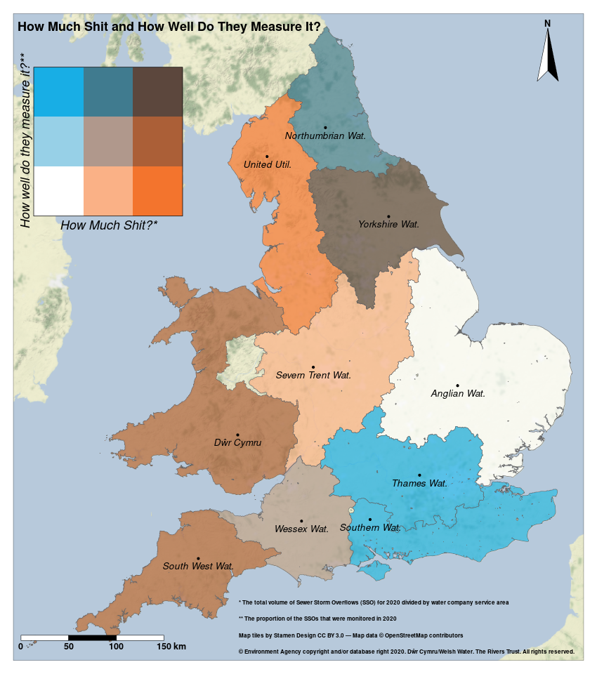

# SewageMapR

Some Maps about sewage...

## Data sourecs:

[**England Unmonitored CSOs 2020**](https://data.catchmentbasedapproach.org/datasets/theriverstrust::-england-unmonitored-csos-2020/about)

[**Welsh Unmonitored CSOs 2020**](https://data.catchmentbasedapproach.org/datasets/theriverstrust::welsh-unmonitored-csos-2020/about)

[**Event Duration Monitoring - Storm Overflows - 2020 (England and Wales)**](https://data.catchmentbasedapproach.org/datasets/theriverstrust::event-duration-monitoring-storm-overflows-2020-england-and-wales/about)

## The map:

