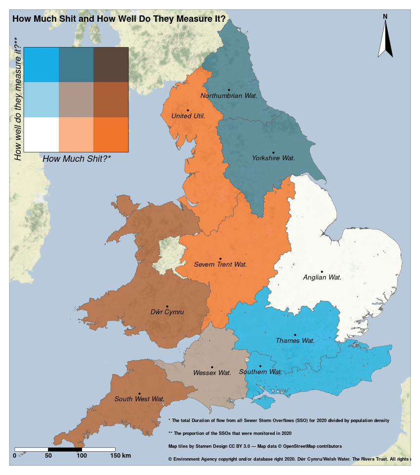
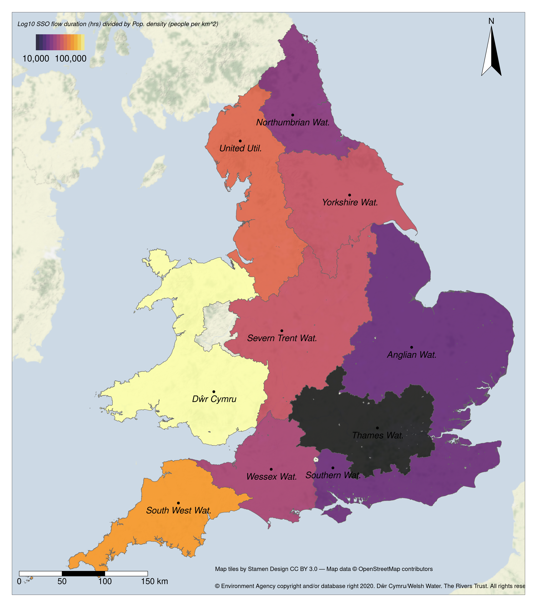
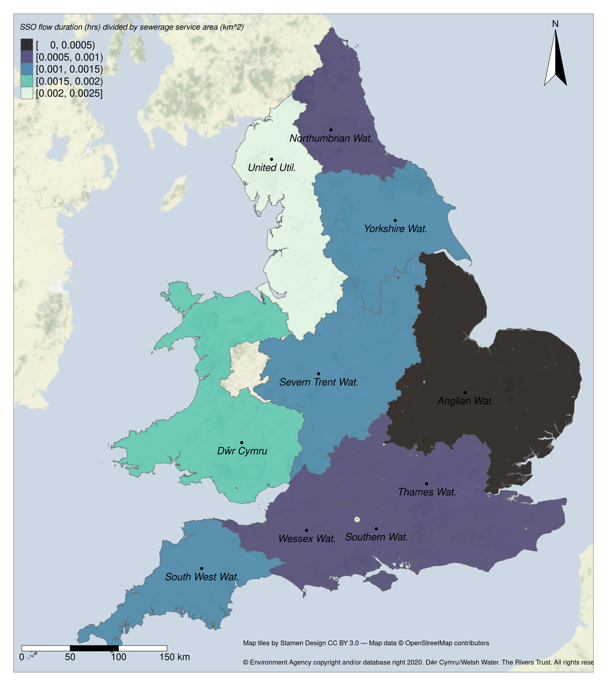

# SewageMapR

Some Maps about Storm Sewage Overflows (SSOs) and how water companies compare in the amount of Sewage released and the amount of monitoring taking place.

Check out the Rivers Trust's great [interactive map](https://experience.arcgis.com/experience/e834e261b53740eba2fe6736e37bbc7b) to explore this data:

## Data sources:

[**England Unmonitored CSOs 2020**](https://data.catchmentbasedapproach.org/datasets/theriverstrust::-england-unmonitored-csos-2020/about)

[**Welsh Unmonitored CSOs 2020**](https://data.catchmentbasedapproach.org/datasets/theriverstrust::welsh-unmonitored-csos-2020/about)

[**Event Duration Monitoring - Storm Overflows - 2020 (England and Wales)**](https://data.catchmentbasedapproach.org/datasets/theriverstrust::event-duration-monitoring-storm-overflows-2020-england-and-wales/about)

[**Ofwat Sewerage Service Areas**](https://commonslibrary.parliament.uk/constituency-information-water-companies/#datasources)

[**Gridded Residential Population Density 2011**](https://data.gov.uk/dataset/ca2daae8-8f36-4279-b15d-78b0463c61db/uk-gridded-population-2011-based-on-census-2011-and-land-cover-map-2015)

## The maps:

1.  First let's compare the volume of SSO discharge (normalised by population density) and the % of SSOs that are actually monitoried. More brown here means lots of SSO discharge but more monitoring. Orange means lots of SSO discharge but low monitoring. Blue shows lower SSO discharge and higher monitoring.

1.  Same story again but now normalising by Sewerage Service Areas...

1.  And finally the full story with no normalising. Perhaps not a fair test but an indication of what's being released.

1.  Choropleth map of the % od monitored SSOs in each sewerage service area.

1.  Choropleth map of the total duration (days) of monitored SSOs in each sewerage service area (normalised by population density)

1.  Choropleth map of the total duration (days) of monitored SSOs in each sewerage service area (normalised by Sewerage Service Area.)

